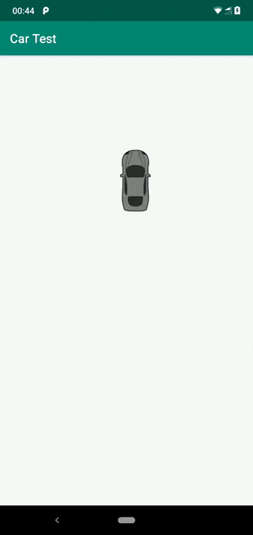

# CarTest
Test task for Citymobil with simple MVP implementation as requested. 
Car moves to tap point using simple method - rotate then move linearly. On double tap it moves more realistic way based on quadratic bezier. 

